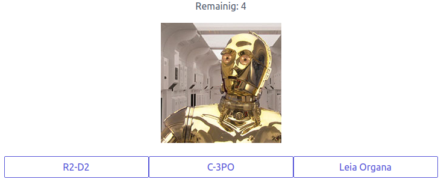
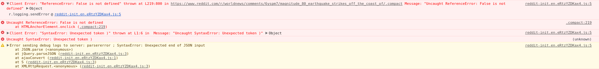

# elm@puzzle

Teaser/ Intro

Schon seit einiger Zeit beschäftigen sich die beiden Puzzlers Andreas Maierhofer
und Max Burri mit der Programmiersprache Elm – anlässlich des 100sten Puzzle
Members haben sie ein Spiel entorfen, womit neu angestellte Members schneller
die anderen Puzzlers kennen lernen können. In leicht abgewandelter und
abgespeckter Form haben sie jetzt dieses Spiel auf Github veröffentlicht und
nebenbei Charaktere, Raumschiffe und Fortbewegungsmittel aus dem
StarWars-Universum kennen gelernt – ihre Erfahrungen mit Elm teilen sie in
diesem Blogpost.

---

Geschrieben von Andreas Maierhofer und Max Burri

---

Elm ist eine Programmiersprache zum Entwickeln von Front-End Applikationen für
den Browser. Als Punchline entnehmen wir der offiziellen Website
(http://elm-lang.org/) folgendes:

A _delightful_ language for _reliable_ webapps. Generate JavaScript with _great
performance_ and _no runtime exceptions_.

Die Versprechen sind ziemlich gewagt:

- Reizend, angenehm (delightful) soll die Sprache sein.
- Zuverlässig (reliable) sind die Webapplikationen
- No runtime exceptions – das haben wir gehört!
- Grossartige Performance wird auch versprochen…

Einigen dieser Versprechen wollten wir für diesen Blog-Post nachgehen und haben
dafür eine kleine Beispielapplikation entwickelt. Diese ist denkbar einfach: Der
Spieler muss aus einer Auswahl von drei Vorschlägen den Namen der abgebildete
StarWars-Figur erraten.



Die StarWars-Kenntnisse können hier <Link einfügen> unter Beweis gestellt
werden. Der Code ist Open Source: <Link aufs Repo>. An dieser Stelle gehen wir
nicht en Détail auf den Code der Applikation ein, sondern möchten einige
Haraustellungsmerkmale der Sprache sowie unsere Eindrücke schildern.

## Was unterscheidet Elm von Javascript?

Elm ist eine rein funktionale Programmiersprache. Ein Compiler übersetzt
Elm-Programme in Javascript, Html und Css damit die Applikation im Browser
lauffähig ist. Elm ist von Haskell inspiriert, vereinfacht aber zahlreiche
Aspekte und bleibt so einsteigerfreundlich.

Die wichtigsten Eigenschaften der Sprache sind:

- Streng statische Typisierung mit Type Inference
- Immutable by default
- kein null oder undefined

Diese Eigenschaften erlauben es dem Compiler, der übrigens in Haskell
geschrieben ist, die formale Korrektheit des Codes wesentlich tiefgreifender zu
prüfen, als dies zum Beispiel der Typescript oder auch der Java Compiler kann.
Insbesondere garantiert der Compiler, dass das ausgelieferte Programm keine
Runtime Exceptions wirft...

## Wirklich? No runtime Exceptions…

Frontend-Entwicklern begegnen ihnen täglich und auch bekannte Websites sind
nicht davor gefeit: 

Elm ist streng statisch typisiert - und der Compiler kann jederzeit die Typen
ableiten. Aber warum ist das wichtig und was heisst das eigentlich?

Ein "strenges statisches" Type-System garantiert uns, dass ganze Kategorien von
Fehlern nicht auftreten können - Ausdrücke die keinen Sinn machen. Zum Beispiel,
wenn eine Zahl als Funktion verwendet werden soll oder wenn wir einer Funktion,
die Zahlen erwartet, einen String füttern. Der Elm Compiler weigert sich,
solchen Code zu compilieren und weist uns, freundlich aber bestimmt, auf unseren
Fehler hin:

```
-- TYPE MISMATCH --------------------------------------------- repl-temp-000.elm

The 2nd argument to function `add` is causing a mismatch.

4|   add 1 (List.head numbers)
            ^^^^^^^^^^^^^^^^^
Function `add` is expecting the 2nd argument to be:

    number

But it is:

    Maybe number

Hint: I always figure out the type of arguments from left to right. If an
argument is acceptable when I check it, I assume it is "correct" in subsequent
checks. So the problem may actually be in how previous arguments interact with
the 2nd.
```

Diese ['menschenfreundliche Fehlermeldungen'](http://elm-lang.org/blog/compiler-errors-for-humans)
geben sind extrem hilfreich. Sie beschreiben genau welches Problem der Compiler
erkannt hat. Bei komplexeren Problemen werden zudem noch Tips, Beispiele oder
Links zur Dokumentation inkludiert.

Ein weiteres Merkmal des Type-Systems ist die Absenz von Null Werten. Dieser
[Billion-Dollar Mistake](https://www.lucidchart.com/techblog/2015/08/31/the-worst-mistake-of-computer-science/)
wird duch einen `Maybe` Typ ersetzt. Der Compiler erkennt, dass der Wert
potentiell nicht definiert ist und zwingt uns diesen Fall zu behandeln.

```
> add 1 (List.head numbers)
-- TYPE MISMATCH --------------------------------------------- repl-temp-000.elm

The 2nd argument to function `add` is causing a mismatch.

4|   add 1 (List.head numbers) ^^^^^^^^^^^^^^^^^^^ Function `add` is expecting
the 2nd argument to be:

    number

But it is:

    Maybe number

Hint: I always figure out the type of arguments from left to right. If an
argument is acceptable when I check it, I assume it is "correct" in subsequent
checks. So the problem may actually be in how previous arguments interact with
the 2nd.
```

Tatsächlich haben wir während der Entwicklung der Applikation nie eine Runtime
Exception erlebt – dies ist auch die Erfahrung in grossen Projekten
(https://www.infoq.com/news/2017/05/elm-zero-runtime-exception)

## Ist das denn tatsächlich „reizend“ (delightful)?

Der Compiler schaut uns also ganz genau auf die Finger. Jeder Fehlerfall muss
behandelt werden, und zwar jetzt und nicht erst später!

Auf den ersten Blick mag dies vielleicht wenig „delightful“ erscheinen, aber in
der Praxis hat sich gezeigt, dass diese Strenge des Compilers zwei wichtige
Vorteile bietet:

1.  Jede Fehlerbehandlung liefert einen Denkanstoss. Wie könnte der
    Laufzeitfehler vermieden werden? Habe ich die richtigen Typen in meinem Model?
    Fehlt dort etwas oder ist gar etwas zu viel? Dadurch erhält man ein stabileres
    und verständlicheres Model woraus dann automatisch auch stabilerer und
    einfacherer Code entsteht.

2.  Bei jedem Refactoring bietet der Compiler seine Unterstützung an. Er liefert
    hilfreiche Fehlermeldungen und wird so zum Pair-Programming-Partner. Bei
    umfangreiche Refactorings steht er jederzeit bereit und führt uns Schritt für
    Schritt durch die notwendigen Anpassungen. Sobald der Code compiliert, kann man
    sicher sein, dass die Applikation wieder formal funktioniert - ob es dann auch
    die Business-Logik tut, kann der Compiler natürlich nicht garantieren.

## Zuverlässige Webapplikationen...

Dieser Punkt hat uns einiges an Kopfzerbrechen bereitet - was ist eigentlich
eine zuverlässige Webapplikation? Reicht es, wenn sie macht, was sie soll - und
zwar ohne Fehler? Wieso unterscheidet die Punchline ("reliable webapps ...
without runtime exceptions") explizit zwischen "zuverlässig" und "ohne Fehler"?

Wir denken, dass "Zuverlässigkeit" den gesamten Lebenszyklus der Wepapp
betrifft, also Plan - Build - Run! (pun intended!). Bei Puzzle setzen wir
regelmässig Webapplikationen mit einer Lebensdauer von mehreren Jahren um. Oft
macht die initiale Entwicklungsphase nur einen Bruchteil des gesamten
Lebenszyklus aus - Wartung, Support und eventuell Weiterentwicklung sind genau
so wichtig.

Das bedeutet für ein solches Projekt:

- Die Teamzusammensetzung wird sich ändern - neue Members müssen eingarbeitet
  werden und sich v.a. auch in der Architektur und dem Code Style der
  Applikation zurecht finden.
- Die eingesetzten Frameworks und Third Party Libraries entwickeln sich ständig
  weiter und sollten ohne gross Aufwände nachgezogen werden.

Unserer Erfahrung nach sind dies zwei Pain Points bei Javascript Applikationen.
Sowohl die Frameworks selbst, aber auch die Build Pipelines und das gesamte
Ökosystem sind einem rasanten Wandel unterzogen. Die Architekturen unterscheiden
sich von einem Projekt zum nächsten, auch bei gleichbleibenden Teams. Es wird
heftig darüber diskutiert, ob und welches State-Management System (redux, ngrx,
mobx, Context API,...) verwendet werden soll - und vor allem Tabs vs. Spaces,
Trailing oder Leading Commas?! Erschwerend kommt hinzu, dass viele der über
700'000 Packages auf npmjs.org es mit dem Semantic Versioning nicht so genau
nehmen - leider. Durch die zahlreichen Abhängigkeiten der Packages - auch
untereinander - führen Upgrades häufig zu Breaking Changes, auch in Minor oder
Patch Releases - das ist übrigens im Java Umfeld nur wenig besser.

Elm bietet hier Lösungen:

- Der Paket Manager von Elm erzwingt echtes Semantic Versioning: Aufgrund der
  Typen und Signaturen der Funktionen in einem Modul kann die exakte neue
  [Versionsnummer](https://github.com/elm-lang/elm-package#version-rules)
  abgeleitet werden.
  Dadurch ist ausgeschlossen, dass Minor oder Patch Upgrades von
  Packages sogenannte "Breaking Changes" enthalten - Upgrades können also
  bedenkenlos eingespielt werden.

- Es gibt nur eine Architektur für Elm-Applikationen - und diese ist direkt in
  die Sprache integriert, also nicht als Package zu installieren - Die
  Elm-Architektur war u.a. inspiration für Redux: _"Redux evolves the ideas of
  Flux, but avoids its complexity by taking cues from Elm. Even if you haven't
  used Flux or Elm, Redux only takes a few minutes to get started with."_ Quelle:
  https://redux.js.org/#influences

  Auf die Details zur [Elm-Architektur](https://guide.elm-lang.org/architecture/)
  einzugehen würde den Rahmen dieses Posts sprengen, aber einen wichtige Konsequenz
  daraus ist: Die Elm-Architektur ermöglicht einen leichten Einstieg für
  Neueinsteiger oder bei Übernahme bestehender Projekte da der Programmfluss
  und Programm Zustand festgelegt sind.
  Diese Architektur wird auch immer angewendet unabhängig von der grösse der
  Applikation – die Frage ob man einen State Manager (bzw. welchen) verwenden
  will stellt sich in Elm nicht, wie in anderen Frameworks
  (https://medium.com/@dan_abramov/you-might-not-need-redux-be46360cf367).

- Die Community hat sich auf einen eigenen Code-Style geeinigt:
  [elm-format](https://github.com/avh4/elm-format/blob/master/README.md) - ohne
  Konfigurationsmöglichkeit, mit einfacher Integration für die gängigen Editoren,
  kommt das Tool mit den abentuerlichsten Formatierungen zurecht und rückt den
  Code - sofern er syntaktisch korrekt ist - wieder ins rechte Licht. Damit erhält
  man übrigens schon einen ersten Hinweis darauf, ob das, was man da geschrieben
  hat auch tatsächlich Sinn macht... besonders für Anfänger ist das sehr hilfreich
  und für den fortgeschrittenen Entwickler macht es einfach Spass, dass man sich
  nicht um die Formatierung kümmern muss.

- Aus unserer Sicht der wichtigste Punkt: Seit dem letzten Elm-Release (0.18)
  sind jetzt dann bald zwei Jahre vergangen. Das tönt merkwürdig, aber das führt
  dazu, dass man eben nicht alle paar Monate den gesamten Tech-Stack nachziehen
  muss, obwohl die Neuerungen im Framework für die eigene Applikation gar nicht
  hilfreich sind - diese Erfahrung [teilen andere Teams mit relativ grossen
  Elm-Applikation in Produktion](https://www.youtube.com/watch?v=uQjivmLan0E).

## Performance

Für den Endbenutzer entscheidend ist schlussendlich die Performance. Obwohl
die Applikation fehlerfrei läuft macht es keinen Spass, muss die Performance
stimmen. In dieser Hinsicht muss man sich bei Elm keine Sorgen machen.
Obwohl schon etwas älter zeigt der Vergleich mit react, angular und ember, dass
die Performance von Elm-Applikationen (auch ohne Optimierungen) durchschnittlich
besser war als mit den damals aktuellen Versionen der vergleichbaren Javascript
Frameworks – vor allem auch mit dem damaligen Branchenprimus Angular.

## Fazit

Die Programmiersprache Elm bietet neue Lösungen für zahlreiche Probleme der
Frontend-Entwicklung. Ein Vergleich mit Frontend-Frameworks ist nur bedingt
sinnvoll, weil die Ausgangslage völlig unterschiedlich ist: angular, react etc.
bauen auf einer anderen Programmiersprache, mit anderen Paradigmen auf und
leiten daraus auch ihr Ökosystem und ihre Architekturen ab. Weil Javascript
wesentlich populärer ist, steht für die entsprechenden Frameworks eine
unüberschaubare Menge an Packages zur Verfügung, wo man bei Elm noch selber Hand
anlegen muss. Aufgaben, die in Javascript trivial sind (z.B. Zufallszahlen)
erfordern in Elm schon einige Konzepte mehr Zudem wird den Entwicklern wird viel
Freiheit entzogen: die Applikationsarchitektur ist vorgegeben, der Code Style
ist fix und man muss sich um alle möglichen und eigentlich unmöglichen
Fehlerfälle kümmern - es scheint, als ob man viel Kreativität aufgibt und in ein
Korsett gezwungen wird.

Was man dafür erhält?

Spass am Entwickeln von Features - es ist eben unglaublich befreiend wenn man
sich nicht ums Tooling kümmern muss, wenn die Architektur klar ist, die
Diskussion um den Code Style entfällt. Man gewinnt Sicherheit bei Anpassungen
und Erweiterungen: Wenn der Compiler zufrieden ist, dann funktioniert alles
wieder. Wenn wir in Elm entwickeln, müssen wir nie Debuggen (das geht auch gar
nicht) oder in verschachtelten Stacktraces in den Devtools des Browsers nach dem
Fehler suchen, um dann präsentiert zu bekommen:

`undefined is not a function (main.js: 1)`

Unsere persönliche Meinung ist klar: Die „Developer Happyness with elm“ (
https://www.youtube.com/watch?v=kuOCx0QeQ5c&t) ist so gut, dass wir und weiter
damit beschäftigen und hoffentlich auch weiter darüber bloggen können.

Wer selbst Elm ausprobieren möchte, kann das sofort tun: Auf
http://elm-lang.org/try steht ein einfacher Online-Editor zur Verfügung, wo man
verschiedene Beispiele (http://elm-lang.org/examples) ausprobieren und anpassen
kann.

Empfohlene Resourcen

- Erste Eindrücke gewinnen: http://elm-lang.org/try
- Die offizielle Dokumentation: http://guide.elm-lang.org
- Verfügbare Packages: http://package.elm-lang.org

Videos/ Talks:

- Ziele von Elm: https://www.youtube.com/watch?v=Te2sQ4st_jY
- Developer Happyness: https://www.youtube.com/watch?v=kuOCx0QeQ5c
- Making impossible States impossible:
  https://www.youtube.com/watch?v=IcgmSRJHu_8
- Gemeinsamkeiten und Unterschiede zu React:
  https://www.youtube.com/watch?v=jl1tGiUiTtI

Ein eigenes Projekt aus dem Boden stampfen:
https://github.com/halfzebra/create-elm-app
